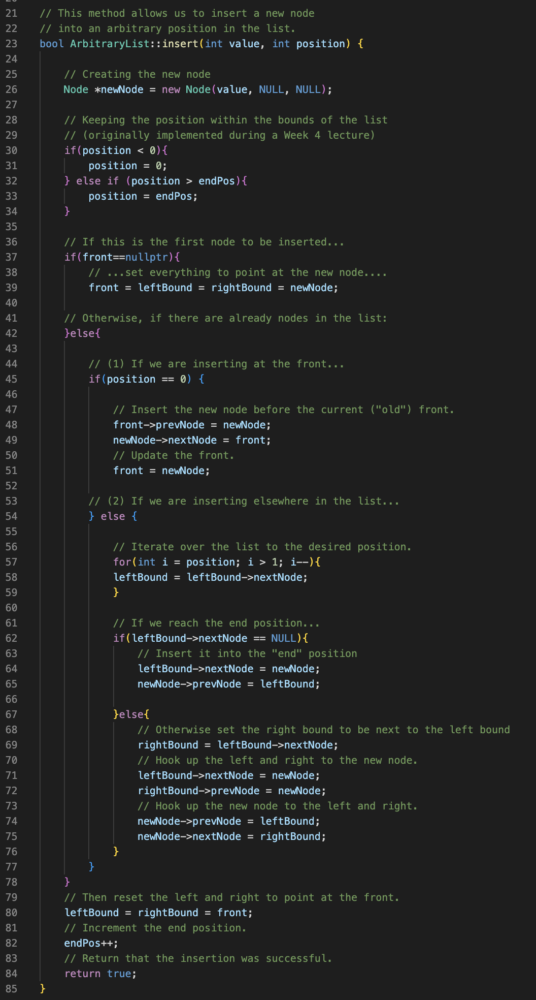

Parker Mayer - CS 260 - 2/6/2023

# Assignment 4: Arbitrary List

## Note:
At the time of submission, I am having some issues with segmentation faults that I am actively trying to troubleshoot (occasionally pop up when peek() or remove() are called--I am not sure yet why this is the case but suspect I need to scrap the current design in favor of something simpler). However, I did manage to get several tests to work (see screenshots below) and will try to update with a better implementation. 

## Design Components
- A doubly linked list class with
    - a pointer to the front
    - pointers to "zero in" on the location in the list we want to target
    - a temporary storage pointer
    - a way to track the "end" of the list
    - an insert method that lets you insert a value at a specified position
    - a remove method that lets you remove a node from a specified position
    - a peek method that takes a position and returns its value
    - a constructor to set up the class variables
- A node class
- A driver file to run tests

## Meeting Requirements

1. "Create a linked-list that allows:"

(a) "an add function that takes a value and inserts it into a given position into the list"

(b) "a remove function that takes a position and removes the value stored at that position of the list and returns it"

(c) "a get function that takes a position and returns that value without removing it"

2. "Include at least one test function for each piece of functionality that should verify that your code is working"

4. "Attempt to analyze the complexity of your implementation with line-by-line analysis"

- For my implementation, I believe that all three of insert(), remove(), and peek() would be O(n) as they have to iterate over the nodes in the linked list (at most n times). 
- On a line-by-line level, all individual lines outside of the for loops should be O(1). (See "Driver.cpp" for line-by-line comments.)

## Resources used:
- Inserting nodes into a doubly linked list: https://www.youtube.com/watch?v=le9RuwN2sQg
