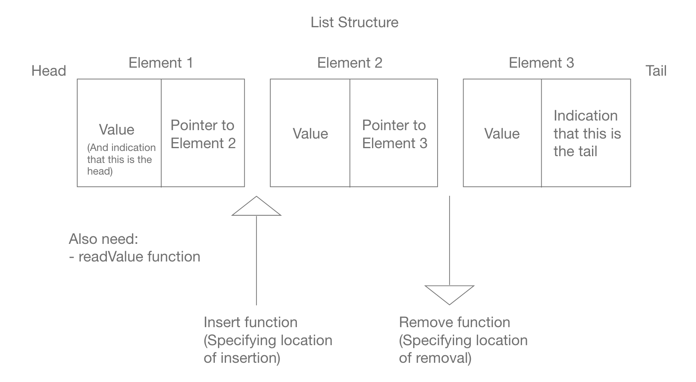

Parker Mayer, CS260, 1/23/23

# Assignment 2: (Design)

## Prompt 1: Based on what we know about linked lists, stacks, and queues, design a queue data structure:
1. What functions are we likely to need for a queue to function like the one discussed in class?

- Since we are dealing with a queue, in which data comes in one side and out the other, I think it would make sense to have an "add element to head" ("enqueue") function and a "remove element from tail" ("dequeue") function.
- Additionally, as was discussed during lecture, it might make sense to have readHead and readTail functions. Eventually, a readAnyElement function could be implemented.

2. What values will we need to know about the structure for our queue to function properly?

In terms of values we need to know, a few would be:
- The location of the front/head and the location of the back/tail.
- The type of data that the queue will need to be able to manage.
- Pointers, since those will be used to link the elements together.

## Prompt 2: Based on what we know about linked lists, design a list data structure that allows us to add (insert) or remove (delete) values at a given location in the list (instead of the top of a stack or the front or back of a queue):
1. What functions are we likely to need for a list to function like this?

The two main functions I envision would be:
- An insert function (would need to know the location of the element to be inserted).
- A remove function (would need to know the location of the element to be removed).
- Additionally, like the queue, a readValue function could be implemented, given the location of the element to be read.

2. What values will we need to know about the structure for our list to function properly?

A few ideas I generated....
- The elements we would need to insert the new element between?
- The element we would want to remove.

I believe we would still need to know the same information as for the queue:

- The location of the front/head and the location of the back/tail.
- The type of data that the queue will need to be able to manage.
- Pointers, since those will be used to link the elements together.

## Note: this design does not feel fully nailed down to me, so I will continue to research and try to get a clearer picture of the specifics of how these designs would be implemented.

