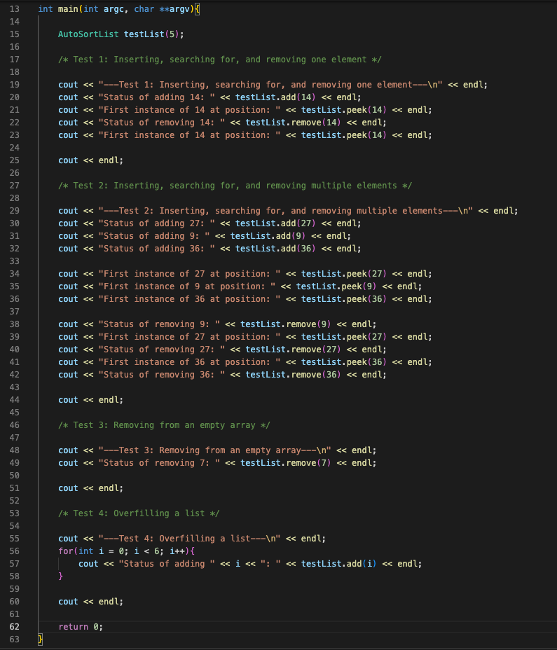
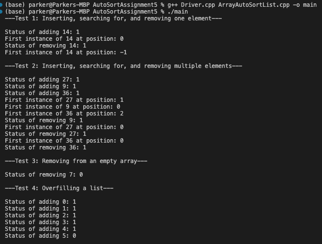
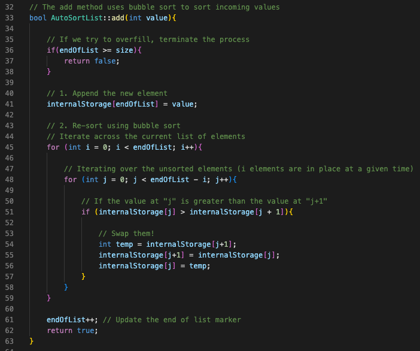
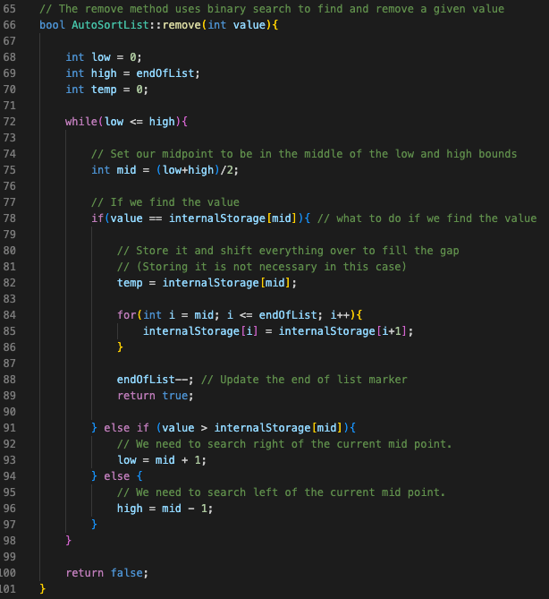
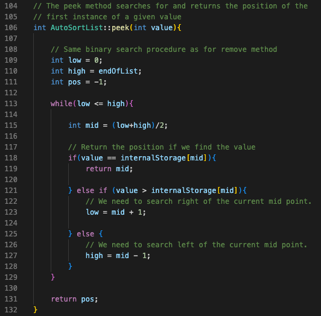
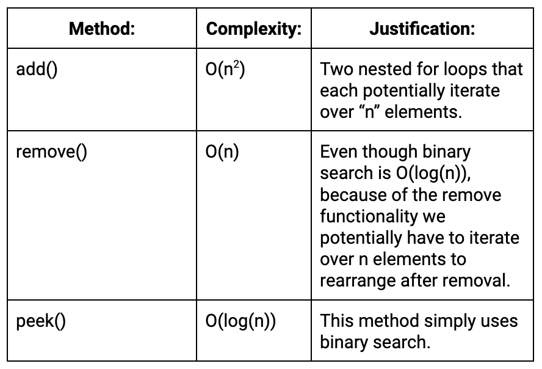

Parker Mayer - CS 260 - 2/13/2023

# Assignment 5 (Auto-sorting list operations)

## 1. Design Components
- An auto sort array class featuring:
    - An add method: inserts values into array and automatically sorts it (using bubble sort) so that ints are in asceding order
    - A remove method: using binary search, searches for and removes a desired value from the array and shifts other elements down
    - A peek method: using binary search, searches for and returns the position of a desired value
- A header file for the class
- A driver file to run tests

## 2. Tests

For this assignment, I ran four tests in the Driver.cpp file.
- Test 1: Inserting, searching for, and removing one element
- Test 2: Inserting, searching for, and removing multiple elements
- Test 3: Removing from an empty array
- Test 4: Overfilling a list

Screenshots of tests and output below:

## 3. "Create an array-based list or a linked-list (and a bonus for attempting both) that:"

(a) "automatically inserts values in the correct position based on some order of sorting (perhaps ascending integers or lexicographical sorting of words)"

(b) "efficiently searches for elements (likely binary search for the array list, but what about the linked-list?)"

## 4. "Make a chart to compare the algorithmic complexity (use Big-O notation) of your insert, remove, and search algorithms you used for your structures"

## Resources used
Bubble sort guide: https://www.geeksforgeeks.org/bubble-sort/
Binary search guide: https://www.geeksforgeeks.org/binary-search/
