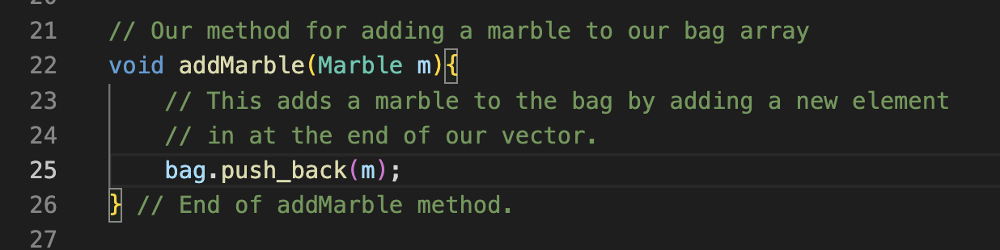
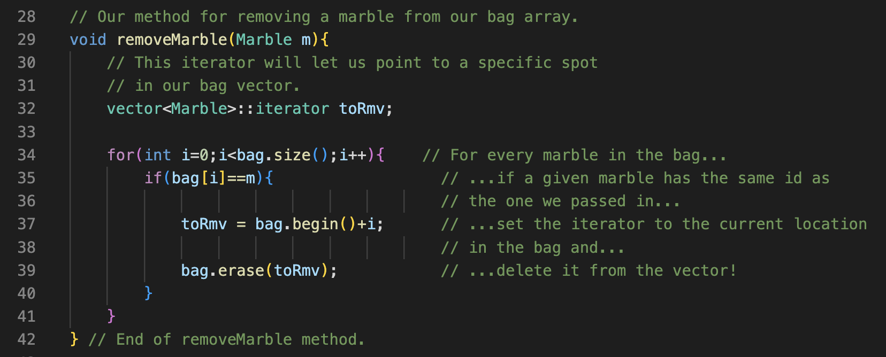
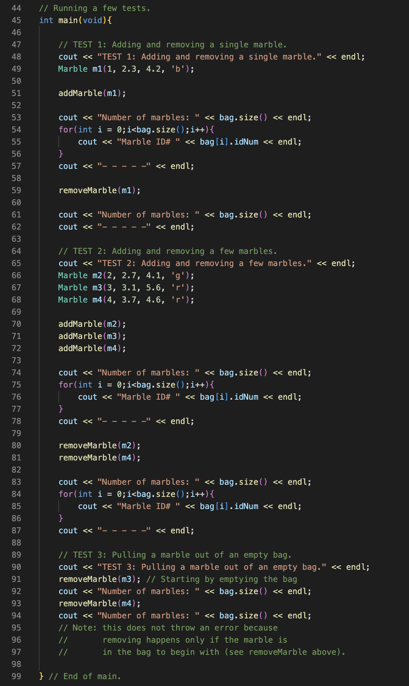

Parker Mayer, CS260, 1/16/23

# Assignment 1: Bag of Marbles

## Initial Note

I struggled to keep the program simple, and I am sure there is a far simpler implementation that exists. I will submit what I have, but will continue to research and brainstorm on how to make this program more concise. Thank you!

## Brainstorming

The goal for this assignment is to model a bag of marbles. There are a few aspects of the model that we need to figure out.

1. What represents a "marble"?
    - I think it would make sense to create a marble class so that we can create marble instances that have specific properties:
        - ID number
        - diameter (mm)
        - mass (g)
        - color ('r' = red, 'g' = green, 'b' = blue)

2. How can we add new marbles to the bag?
    - Create a method where you pass in the marble you want to add to the bag.
    - Could use an array? Note: after researching, it seems that for C++ a vector would make sense because the "bag" should be able to adjust size depending on number of marbles.

3. How can we remove marbles from the bag?
    - Analogous to adding, we'd create a method where you pass in the marble you want to remove from the bag.

4. What are some tests that we can run to verify that the program is working?
    - I'll run these tests in the driver file:
        1. Single-marble case
        2. Multi-marble case
        3. Pulling a marble out of an empty bag

## Implementation

There are two files associated with this assignment.
    - Marble.cpp: This is home to the Marble class file.
    - Bag.cpp: This is our driver file that contains the tests, as well as the methods for adding/removing marbles.

## Meeting Requirements

1. Representing a marble. This requirement is met via the file Marble.cpp (the entire file) which allows us to represent marbles as objects.

2. We can add marbles via the addMarble method in Bag.cpp:

3. We can remove marbles via the removeMarble method in Bag.cpp:

4. We run tests 1, 2, and 3 in the main method in Bag.cpp:

## Resources Used

For figuring out how to make a class in C++:
- https://www.youtube.com/watch?v=3dHBFBw13E0
- https://www.w3schools.com/cpp/cpp_constructors.asp

For figuring out how to use vectors in C++:
- https://www.youtube.com/watch?v=PocJ5jXv8No
- https://www.geeksforgeeks.org/vector-in-cpp-stl/
    
For figuring out how to compare objects in C++:
- https://www.youtube.com/watch?v=cpCl6HQQV-s
