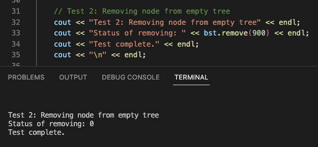
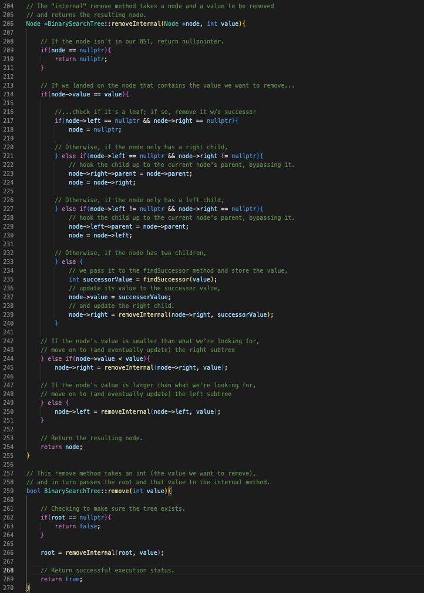

Parker Mayer - CS 260 - 2/27/2023

# Assignment 6 - Binary Search Tree

## Design Components

A BinarySearchTree class with methods for:
- adding a value
- printing the values in the tree using in-order traversal
- searching for a value in the tree
- finding the minimum value in the tree
- finding the successor for a removal, and
- removing a node.

It has one member, a Node pointer that points to the root node.

The Node class has members for:
- the value it stores
- a pointer to its left child
- a pointer to its right child
- a pointer to its parent

## 1. Tests

- Test 1: Adding, traversing, and removing one node

- Test 2: Removing a node from empty tree

- Test 3: Adding, traversing, and removing multiple nodes

- Test 4: Searching for values & finding the minimum value in a tree

## 2. "Implement a binary search tree that includes:"

### (a) "nodes to store values,"

See "BinarySearchTreeNode.h"

### (b) "an add function that adds a new value in the appropriate location based on our ordering rules, (I likely used less than or equal to going to the left and greater than values going to the right)"

See "BinarySearchTree.h"

### (c) "a remove function that finds and removes a value and then picks an appropriate replacement node (successor is a term often used for this)"

See "BinarySearchTree.h"

The remove method has a few supporting methods (search, findSuccessor, findMin) the screenshots for which are below.

### (d) "we have at least one tree traversal function (I recommend starting with an in-order traversal!)"

See "BinarySearchTree.h"

## 3. "Analyze and compare the complexity of insert and search as compared to a binary tree without any order in its nodes."

If the BST is ordered (and relatively balanced), the add and search methods would be O(log(n)). However, without ordering (or if the tree becomes very skewed) then we approach O(n) as we are essentially moving down a linked list.

## Resources used:
- For general guidance on building the BST: https://hub.packtpub.com/binary-search-tree-tutorial/.
- Helpful tree traversal information: https://en.wikipedia.org/wiki/Tree_traversal.
- Code written in class during Week 6.
