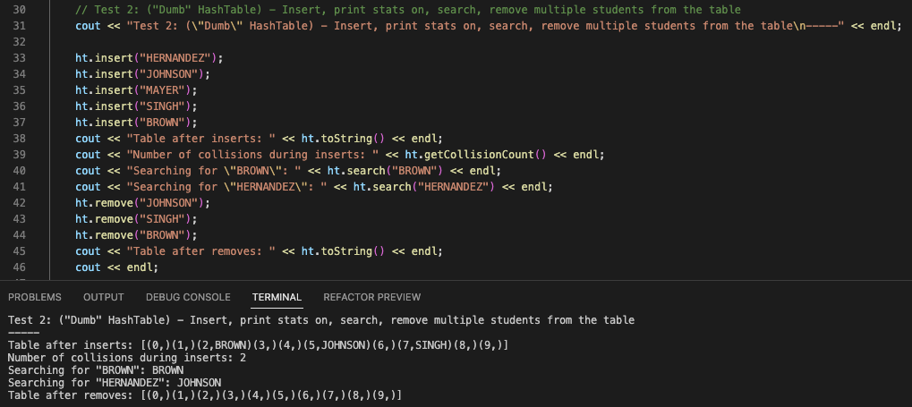
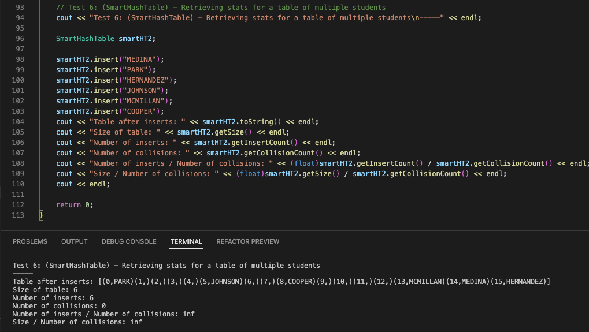
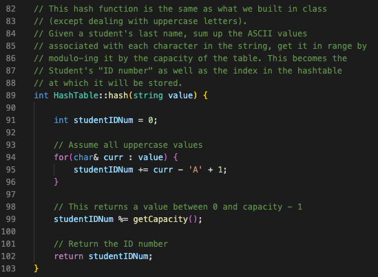

Parker Mayer - CS 260 - 3/6/2023

# Assignment 7 - Hashtable

## 1. "Create a design before you begin to code that describes or shows how we can store data in a hash table and what kind of problem we could solve with a hash table."

Design: Given a student's last name (in all caps), generate a student ID number using a hash function. Also, store the student at the ID number index in a hashtable (vector).
This is a basic design that gives us a "database" of sorts that associates each student with their ID number. In the future, more information associated with each student could be added.

- "Dumb" Hashtable has
    - a hash method that takes the student's last name in all caps and calculates the ASCII sum of the characters (modulo the hashtable's capacity to keep it in range)
    - an insert method that takes a student's last name in all caps, hashes it, and stores it at the "ID number" index (if there's a collison, it simply overwrites it)
    - a search method that takes a student's last name, hashes it, and returns the name currently stored at that index.
    - a remove method that takes a student's last name, hashes it, and removes if the name matches the name stored at that index
    - member variables that store the hashtable vector, size, capacity, number of inserts, and number of collisions
    - getter methods for capacity, size, fullness, number of inserts, number of collisions (we can use these for helpful stats)
    - toString method for printing out the current table

- "Smart" Hashtable has
    - a hash method that takes the student's last name in all caps and calculates the ASCII sum of the characters (modulo the hashtable's capacity to keep it in range)
    - an insert method that takes a student's last name in all caps, hashes it, and stores it at the "ID number" index
        - If there's a collision at insertion, use a doubleHash method to generate a slightly different ID number (with the goal of lowering number of collisions)
    - a search method that takes a student's last name, hashes it, and returns the name currently stored at that index.
    - a remove method that takes a student's last name, hashes it, and removes if the name matches the name stored at that index
    - member variables that store the hashtable vector, size, capacity, number of inserts, and number of collisions
    - getter methods for capacity, size, fullness, number of inserts, number of collisions (we can use these for helpful stats)
    - toString method for printing out the current table

## 2. "Create some tests (at least one per piece of functionality) before you begin coding that you want your hashtable to pass before you start coding."

- Test 1: ("Dumb" HashTable) - Insert, search, and remove one student from the table

- Test 2: ("Dumb" HashTable) - Insert, print stats on, search, remove multiple students from the table

- Test 3: ("Dumb" HashTable) - Overwriting a student

- Test 4: ("Dumb" HashTable) - Retrieving stats for a table of multiple students

- Test 5: (SmartHashTable) - Double hashing a student to place them in a new table

- Test 6: (SmartHashTable) - Retrieving stats for a table of multiple students

## 3. "Create a hashtable that resolves collisions by simply overwriting the old value with the new value, including at least:"
### (a) "Describe the way that you decide on hashing a value"

### (b) "An insert function that places the value at the appropriate location based on its hash value"

### (c) "A contains function that returns whether the value is already in the hashtable"

### (d) "(optional) A delete function that removes a value based on its hash and then returns that value…"

## 4. "Then create a smarter hashtable (double hashing or chaining) including at least the same functions as the simple hashtable"

I used double hashing for my smart(er) hashtable. Please see SmartHashTable.cpp for full code. Screenshot of modified insert method and doubleHash method is below.

## 5. "Compare some information relating to collisions (frequency) and their effect on complexity (of insert and contains methods)"

As we can see in Tests 4 and 6 above, The double hashing reduced the number of collisions. For a table of size 16, with 6 insertions, the table with no double hashing had 2 collisions,
while the smart hash table had zero collisions.

If 'n' is the number of characters in a student's last name, then the insert for the "dumb" hashtable would be O(n) (because it has to add up the values of each character in the string). the "contains" method is O(n) because we have to hash the incoming value prior to searching the table at that location.

The double hashing insert and "contains" method would also (I believe) be O(n) because, in the event of double hashing on an insert, you would iterate over the characters twice. This gives a worst case of O(2n) which we reduce to O(n).

## Resources Used
- Code created in class during Weeks 7 and 8
- General Hashtable guide: https://www.hackerearth.com/practice/data-structures/hash-tables/basics-of-hash-tables/tutorial/
- Theory behind double hashing: https://www.scaler.com/topics/data-structures/double-hashing/
