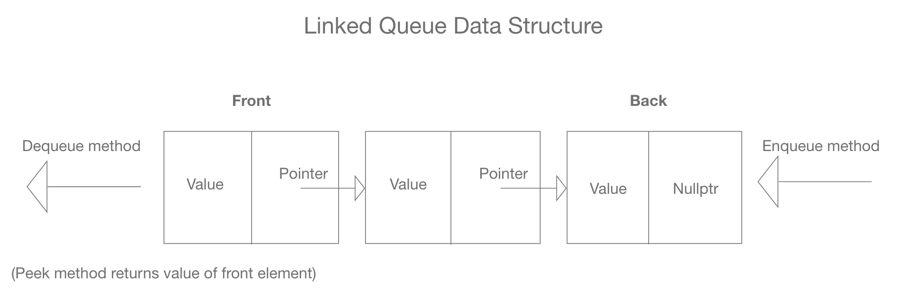
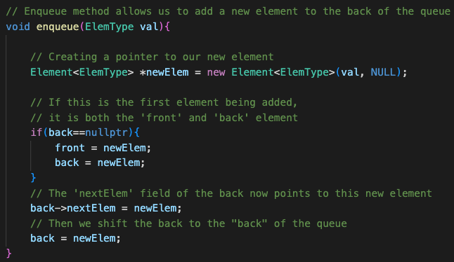
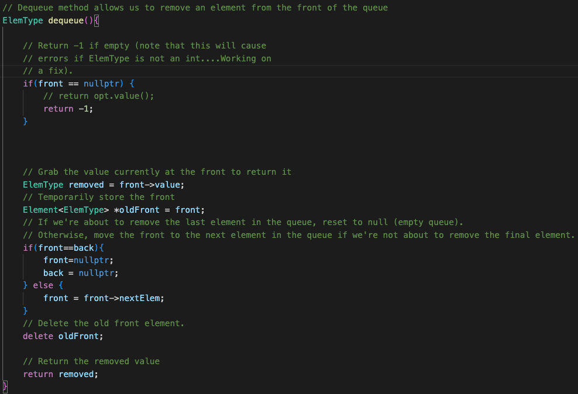
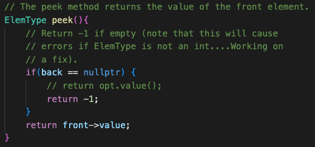
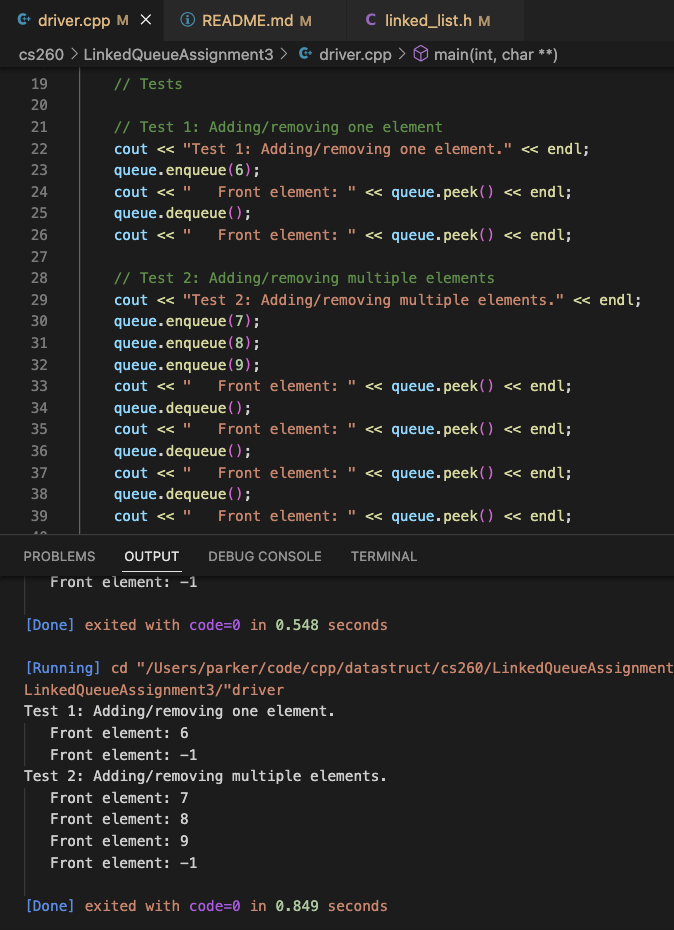

# Assignment 3: Linked Queue

Parker Mayer
CS 260
1/30/2023

Below I will step through the assignment requirements and highlight where each is met in the code.

## 1. "Based on what we know about linked lists, stacks, and queues, design a linked queue (a queue using a linked-list to store the data in the structure)"

Below is my design for the linked queue:

## 2. "Design, implement, and test a Queue data structure that:"

(a) "uses a linked-list to store values in the queue"
    See "linked_list.h" file for the linked-list structure.

(b) "has an enqueue method that will appropriately add a value to the back of the queue as an appropriate element"
    

(c) "has a dequeue method that will appropriately remove an element from the front of the queue and return its value"
    

(d) "Optionally has a peek method that returns the value at the front of the queue without removing it"
    

## 3. "Analyze the complexity of your implementations (at least the run-time of the add, remove, and peek methods)."

- enqueue(). According to https://www.bigocheatsheet.com/ I believe this is equivalent to a Singly-Linked List insertion
- dequeue().
- peek().

## 4. "Tests: Be sure to include at least one test for each piece of functionality that should verify that your code is working!"

- All three methods are tested in "driver.cpp". Screenshot of test output:
